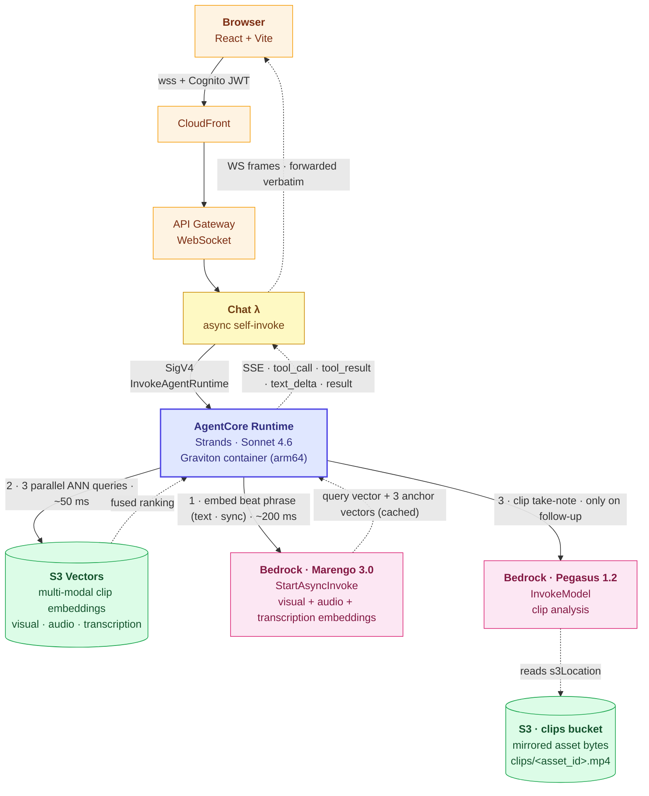
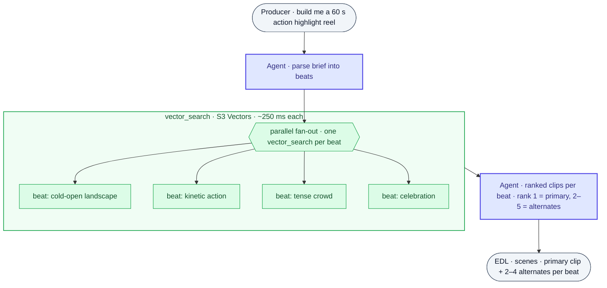
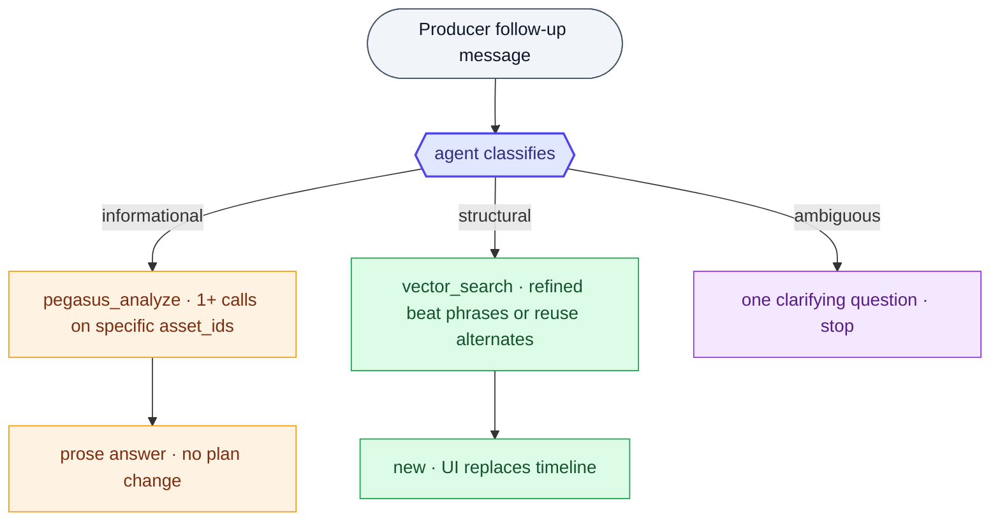

# Building Agentic Highlight-Reel Pipelines on AWS

**An AgentCore × TwelveLabs reference architecture**

## 1 · Introduction

This paper describes an AWS-native pattern for building agentic video
retrieval systems. All four heavyweight primitives — clip embeddings
(Marengo 3.0), clip analysis (Pegasus 1.2), ANN retrieval (S3
Vectors), and agent runtime (Bedrock AgentCore) — run as managed AWS
services. The customer-deployed surface is small and stateless: one
arm64 Strands agent container, a chat lambda that relays browser
WebSocket frames into AgentCore's `InvokeAgentRuntime` endpoint, a
proxy lambda that forwards TwelveLabs HTTP calls, and the S3 bucket
that mirrors source clips for Bedrock to read. No live-query hop
crosses an account boundary; `bedrock:InvokeModel` and
`s3vectors:QueryVectors` calls are signed with the runtime's IAM
role and stay inside the customer's region.

The worked example is a Rough Cut / Highlight Reel agent: a producer
types a brief in natural language and the agent returns an Edit
Decision List (EDL) — the ordered run of clips with HH:MM:SS in/out
times and 2–4 ranked alternates per clip that an editor can swap
into the cut. The same composition applies to any vertical with an
indexed video corpus and beat-structured queries (sports highlight
extraction, surveillance forensics, ad-creative search,
content-rating triage); the index, the runtime, and the tool catalog
are identical across verticals — only the system prompt and the
beat-extraction shape change.

The runtime exposes one tool surface, `vector_search`, that runs
multi-vector retrieval over Marengo 3.0's three modality embeddings
(visual, audio, transcription) stored side-by-side in an S3 Vectors
index. At query time the tool embeds the beat phrase once through
Marengo's text encoder (sync `bedrock:InvokeModel`), computes
per-query routing weights via a softmax over similarity-to-anchor
(`α = 10` temperature, anchors tuned to cinematic vocabulary), runs
three parallel `s3vectors:QueryVectors` calls scoped by
`(knowledge_store_id, embedding_option)`, and score-fuses the
results. Per-beat retrieval lands in ~300 ms p50; a six-beat reel
returns end-to-end in under 15 s when no take-notes are required and
under 60 s when every beat additionally calls Pegasus.

The first EDL is rarely the final cut. Conversation mode preserves
the AgentCore Runtime session across follow-up turns and embeds the
live plan inline as `[CURRENT PLAN] <plan>{...}</plan> [FOLLOWUP]
{...}`, so the agent always reasons over the current state of the
cut. Each follow-up is classified as **informational** (calls
`pegasus_analyze` on a specific `asset_id` to ground a prose answer
in what the model actually sees on screen), **structural** (calls
`vector_search` with a refined beat phrase and emits a fresh
`<plan>` block), or **ambiguous** (asks one clarifying question and
stops). The chat lambda parses the SSE stream from
`InvokeAgentRuntime` and forwards `tool_call`, `tool_result`, and
`text_delta` events verbatim to the browser, so the producer sees
the agent reason in wall-clock order rather than as a 60-second
spinner.

---

## 2 · The problem

### 2.1 What a producer actually does

Today, "build me a 60-second action highlight reel" is a multi-hour task:

1. Scrub the source footage (or trust someone else's notes).
2. Find candidate clips by memory, filename, or a brittle search.
3. Pick in/out points.
4. Stitch and review.
5. Iterate.

The shared property of every minute spent: the producer is the only
component in the system that has watched the video. Everything else
(filenames, transcripts, manual logs) is a proxy for what's actually on
screen.

### 2.2 What "good" looks like

The agent should be able to ask the library: *"clips that look like a
celebration after a tense moment"*, and get clip-level results with start
and end timecodes, ranked by semantic match, with a one-line *why*. That
is what Marengo and Pegasus return.

---

## 3 · Architecture overview

### 3.1 Component map

### 3.2 One retrieval primitive

The agent has one retrieval primitive at its tool surface: `vector_search`.
Under the hood that tool runs multi-vector retrieval. Marengo 3.0 emits
three 512-dim embeddings per segment (visual, audio, transcription)
and the index stores all three side by side. At query time
`vector_search` embeds the beat phrase once, then runs three parallel
ANN queries (one per modality) and score-fuses them with
intent-derived weights. Pegasus is reserved for take-note generation
when a beat needs prose, not retrieval.

The weights come from the embedding-space similarity between the query
and three short anchor texts that name each modality
(*"visual elements of the video"*, *"audio elements"*,
*"spoken words"*). A softmax over those similarities gives
`(w_v, w_a, w_t)`. Queries about *what is seen* lean visual; *who said
what* leans transcription; *what is heard* (music, applause, sirens)
leans audio. The agent receives a single ranked clip list back; the
modality routing is internal to the tool.

| Tool | p50 latency | Purpose |
|---|---|---|
| `vector_search` (text embed + 3 parallel ANN + fusion) | ~300 ms | Ranked clip-level retrieval per beat |
| `pegasus_analyze` | 5–15 s | Look at a specific clip and answer a question about what it visibly contains. Used to ground informational follow-ups in dialogue, not during the first cut. |

A typical six-beat rough cut runs every beat through `vector_search` in
parallel and assembles the EDL in a single agent turn:

### 3.3 Conversation mode

The first cut is rarely the final cut. The agent keeps the same
AgentCore Runtime session across follow-up turns, so producer messages
after the initial brief reuse the conversation context the runtime
already holds. Each follow-up user message also embeds the live EDL
inline as `[CURRENT PLAN] <plan>{...}</plan> [FOLLOWUP] {message}`, so
the agent always reasons over the current state of the cut even if
session memory lapses.

Every follow-up is classified into one of three shapes before the
agent decides which tools to call:

| Shape | Producer intent (examples) | Tools | Reply |
|---|---|---|---|
| **Informational** | "What's visually happening in scene 2 clip 1?" · "Do scenes 1 and 4 feel similar?" · "Is the celebration shot bright enough?" | `pegasus_analyze` on the clip's `asset_id`, grounding the answer in what the model actually sees on screen | Plain prose. No `<plan>` block. |
| **Structural** | "Swap that for something more kinetic" · "Drop scene 3" · "Extend the cut to 45 seconds" · "Use the rank-2 alternate on scene 4 clip 1" | `vector_search` for fresh candidates, plus existing alternates already on the plan | One or two sentences explaining the change, then a fresh full `<plan>` |
| **Ambiguous** | (could be either) | none | A single clarifying question |

The UI surfaces this as a chat thread that replaces the script input
once the first plan exists. Agent text deltas stream into the latest
assistant message as they arrive; the `<plan>` block is hidden from
the chat view and extracted onto the timeline when the turn finishes.
A "new cut" button discards the conversation and starts a fresh
session.

---

## 4 · Embedding-RAG for video clips

### 4.1 What we keep from text RAG, and what changes

Standard text RAG on AWS is well understood: chunk the corpus at index
time, compute embeddings, store the vectors in a managed index (S3
Vectors, OpenSearch, Bedrock Knowledge Bases), and at query time embed
the user's question and retrieve the top-K nearest chunks. The shape of
the architecture for video is the same. The two pieces that change are:

- **The chunker is Marengo.** Marengo segments a video into clip-level
  units automatically (typically 5–10 s shots, aware of cuts and
  motion). There is no manual chunking decision to make.
- **The embedding model is multimodal.** Marengo embeds both video
  clips and text queries into the same vector space. The producer's
  beat ("kinetic action with crowd reaction") becomes a vector that is
  natively comparable to every clip in the index.
- **The signal is not one vector per clip.** Marengo 3.0 emits three
  512-dim embeddings per segment, **visual**, **audio**, and
  **transcription**, and the reference architecture persists all
  three (TwelveLabs' "multi-vector retrieval" pattern). A query like
  *"starring Brad Pitt"* lands on the transcription embedding when the
  trailer's narration says it; *"kinetic action with crowd reaction"*
  lands on visual; *"audience erupts"* lands on audio. Collapsing
  these into a single fused vector would average them into noise.

### 4.2 The shape of an indexed clip

At ingest time, every asset is segmented and embedded by Marengo. Each
clip produces up to three rows in the S3 Vector index, one per
modality, co-keyed so the runtime can fuse them:

| Field | Source |
|---|---|
| `id` | `<asset_id>:<start_sec>:<end_sec>:<modality>:<seg>` |
| `vector` | Marengo modality embedding (512-dim float) |
| `embedding_option` | `visual`, `audio`, or `transcription`; filterable per-query |
| `asset_id` | Asset id (the basename of the mirrored S3 object) |
| `knowledge_store_id` | Filterable attribute for namespace scoping |
| `start_sec`, `end_sec` | Clip boundaries inside the source asset |
| `s3_uri` | The mirrored asset's `s3://...` URI; handed to Pegasus on follow-up |

A clip with no speech has no transcription row; a clip without an
audio track has only visual. The index gains 1–3× the rows over a
single-modality build, but the modality stays *separable* at retrieval
time. The clip-level granularity is what makes alternates work
cheaply: rank 1 is the primary, ranks 2–5 are sibling clips by
definition similar in the fused-modality space, and they already
carry their own timecodes.

### 4.3 Building the index

Ingest is an upstream process, run once per knowledge store, and is
not part of the agent's live-query path. The agent only ever *reads*
the index via `vector_search`; writing the index is the job of the
ingest script (or a separate background pipeline in a production
deployment). This separation is what makes the agent's per-turn
latency a function of retrieval and reasoning only, and lets a single
index back any number of agent sessions across a movie catalog.

The pipeline is AWS-native end to end: the source video is mirrored
into a private S3 bucket, Marengo runs as a Bedrock async invocation
against that S3 object, and the resulting clip embeddings are upserted
into the S3 Vectors index.

```mermaid
flowchart LR
    Script["<b>scripts/ingest_vectors.py</b><br/>ks_&lt;id&gt;"]
    Mirror["Stage asset bytes<br/>s3://&lt;clips&gt;/clips/&lt;asset_id&gt;.mp4"]
    Embed["<b>Bedrock · Marengo 3.0</b><br/>StartAsyncInvoke<br/>embeddingOption: V, A, T"]
    Output[("<b>S3 · async output</b><br/>embeddings/&lt;inv_id&gt;/output.json<br/>3 segments per clip")]
    Batch["PutVectors · batched<br/>one row per (clip, modality)"]
    Index[("<b>S3 Vectors</b><br/>tl-agentcore-clips")]

    Script --> Mirror
    Mirror --> Embed
    Embed --> Output
    Output --> Batch
    Batch --> Index

    classDef script  fill:#fef9c3,stroke:#ca8a04,stroke-width:1px,color:#713f12
    classDef step    fill:#dbeafe,stroke:#2563eb,stroke-width:1px,color:#1e3a8a
    classDef bedrock fill:#fce7f3,stroke:#db2777,stroke-width:1px,color:#831843
    classDef store   fill:#dcfce7,stroke:#16a34a,stroke-width:1px,color:#14532d

    class Script script
    class Mirror,Batch step
    class Embed bedrock
    class Output,Index store
```

The ingest call sets `video.embeddingOption: ["visual", "audio",
"transcription"]` on the Bedrock `StartAsyncInvoke` request. Marengo
returns one clip-scope segment per modality per clip (modalities that
the source content doesn't carry, e.g. transcription on a music-only
trailer, are simply absent). The ingest script reads the
async-invoke output, keeps clip-scope segments, and writes one S3
Vectors row per `(clip, modality)`. A typical 10-minute trailer with
narration produces ~180–360 vectors (60–120 clip-segments × up to
three modalities). Throughput is gated by Bedrock async embedding
capacity and `PutVectors` batches of 500.

A single agent tool reads the index at runtime: `vector_search(query_text,
knowledge_store_id, k=5)`. It embeds the query once via Marengo's text
encoder, derives modality routing weights from anchor-similarity, runs
three parallel ANN queries scoped by `knowledge_store_id` +
`embedding_option`, and score-fuses them. The agent receives one
ranked clip list back.

### 4.4 Why this lands cleanly

- **Modality-separable signal.** Dialogue queries route to the
  transcription embedding; sound-event queries route to audio;
  framing/composition queries route to visual. A single fused vector
  per clip would systematically underweight whichever modality
  actually carried the answer for any given query.
- **Beat phrases go to the model raw.** The producer's text travels
  unmodified through Marengo's text encoder into the same space as
  the indexed clips. *"Celebration after a tense moment"* and
  *"quiet vineyard wide shot"* both work without any intermediate
  vocabulary or tag dictionary to maintain.
- **Native AWS retrieval surface.** S3 Vectors is the AWS-managed
  vector index pattern, so the same index can back a Bedrock
  Knowledge Base or any other AWS-side retriever without re-embedding.

### 4.5 Latency, end-to-end

| Stage (per beat) | Latency |
|---|---|
| Marengo text encode of beat phrase (Bedrock InvokeModel) | ~200 ms |
| 3 parallel S3 Vectors ANN queries (one per modality, k=25 each) | ~50 ms |
| Anchor-similarity routing + score-fusion (local) | <5 ms |
| `pegasus_analyze` (Bedrock 1.2 InvokeModel) | 3–10 s, only on follow-up |

The three modality queries run in parallel, so the total retrieval
budget per beat stays close to the single-query case (~300 ms p50).
The routing anchors are embedded once at runtime startup and cached
for the life of the container.

A 6-beat reel: ~1.5 s of retrieval in parallel + agent overhead +
optional Pegasus per beat. End-to-end, an interactive request lands in
under 15 s when no take-notes are required, and under 60 s when every
beat needs Pegasus.

### 4.6 Why we don't enrich at ingest

A natural follow-up question is whether richer concepts — emotion tone,
character identities, scene-vs-shot taxonomy, action labels — need to
be extracted at ingest as structured filterable fields. The answer in
this architecture is no, and it is no for the same reasons across every
TwelveLabs reference architecture that ships agents over video corpora.

In Jockey (TwelveLabs' canonical conversational video agent), the
runtime is a LangGraph supervisor over three workers: `video-search`,
`video-text-generation`, and `video-editing`. Search calls Marengo at
query time over an already-built index; `video-text-generation` calls
Pegasus *at query time* on retrieved hits to produce summaries,
highlights, chapters, or answers to open-ended prompts about a specific
clip. Jockey has no ingest pipeline of its own — the index is created
out of band, and the agent never pre-extracts character lists or
emotion tags. The same shape repeats in `tl-marengo-bedrock-s3` and the
official TwelveLabs Bedrock workshop: Marengo embed at ingest,
multimodal ANN at query time, Pegasus reserved for on-demand grounding
of specific candidates.

tl-agentcore follows the same pattern by design. `vector_search` does
retrieval over the three Marengo modalities. `pegasus_analyze` is the
query-time grounding tool, called from conversation mode when the
producer asks something embedding distance alone cannot answer
("what's visually happening in scene 2 clip 1?", "do scenes 1 and 4
feel similar?"). The signal a producer is reaching for when they say
*"tense crowd scene with the protagonist showing fear"* is largely
already in the embeddings — visual carries framing and crowd density,
audio carries musical tension, transcription carries named characters
when narration mentions them — and the rare clip that retrieves
ambiguously is exactly the case where calling Pegasus on the matched
candidate is more accurate than relying on an ingest-time inference
that was made without the producer's question in mind.

Pre-extracting structured metadata at ingest is a defensible
optimization for certain operational concerns — caching hot fields,
enabling cross-corpus filtering, restricting search to licensed
material — but it carries three real costs that argue against making
it the default:

- **Ingest cost multiplies.** A Pegasus call per clip is 3–10 s of
  Bedrock time per clip, against ~milliseconds per row to `PutVectors`.
  A 10-minute trailer goes from \~tens of seconds of embedding work to
  10+ minutes of Pegasus work; a 1000-asset catalog goes from hours to
  days.
- **The taxonomy gets fixed at ingest.** Whatever fields Pegasus is
  told to emit are the fields the index supports forever. Renaming a
  category, adding *"chase sequence"* as a label, or changing the
  emotion scale from five categories to seven all require a full
  re-ingest. Embedding-space retrieval has no schema to maintain.
- **Signal duplication.** Most of what Pegasus could tag is already
  reachable through Marengo's three modalities. Adding a separate
  *"emotion=tense"* filter on top of an embedding that already encodes
  tension under the hood gives the agent two redundant routes to the
  same clip and a real route to disagree with itself.

Filterable metadata fields that **don't** depend on Pegasus inference
— rights window, language, content rating, source asset id, license
expiry, segment id — are a different conversation: those are
ingest-time facts and belong on the S3 Vectors row. The filter
syntax `vector_search` uses (`$and` over multiple metadata fields,
`agent/tl_agentcore/agent.py` lines 174–177) already supports adding
them.

---

## 5 · The agent tool catalog

Detailed contract for each tool. Source of truth: `agent/tl_agentcore/agent.py`.

### 5.1 `vector_search(query_text, knowledge_store_id, k=5)`

The retrieval primitive. Three steps inside one tool call:

1. **Embed the query** once via Bedrock Marengo text encoder
   (`inputType: "text"`, sync `InvokeModel`).
2. **Compute modality routing weights.** Three short anchor texts,
   one per modality, are embedded the first time the container
   serves a request and cached for its lifetime. For each query we
   take the cosine similarity between the query embedding and each
   anchor, scale by `α = 10`, and softmax: `(w_v, w_a, w_t) =
   σ(α · sim(q, [AncV, AncA, AncT]))`. A dialogue query lands a high
   weight on transcription; a framing query lands a high weight on
   visual.

   The anchor strings themselves are tuned to the highlight-reel /
   film-catalog use case — they are written in the vocabulary a
   producer would use to describe each modality. Concretely:

   - **visual:** *"On-screen action, shots, framing, camera movement,
     lighting, and composition."*
   - **audio:** *"Music score, sound design, sound effects, ambience,
     and non-speech audio."*
   - **transcription:** *"Spoken dialogue, narration, voice-over, and
     on-screen speech."*

   The softmax only requires the three anchors to be semantically
   *distinct*, so the system is stable to wording, but anchors that
   sit closer to the domain of the queries that will arrive give
   tighter routing on borderline phrases (e.g. *"low-angle hero
   shot"* leans further toward visual than it would against a generic
   *"visual elements of the video"* anchor). The TwelveLabs
   multi-vector search guide ships a generic default; production
   deployments in non-cinematic verticals (surveillance, sports
   broadcast, security) should re-tune these strings to that
   vocabulary. The temperature `α = 10` is the doc-recommended
   default and the routing is not sensitive to small perturbations.
3. **Run three parallel ANN queries** against the S3 Vectors index,
   each filtered by `knowledge_store_id` AND `embedding_option` (one
   filter value per modality). Over-fetch (top-25 per modality) so
   the fusion has signal, then score-fuse:
   `score(s) = Σ_m w_m · sim(q, E_m(s))`. Deduplicate by
   `(asset_id, start_sec, end_sec)` and return the top-k clips.

Each returned clip carries `asset_id`, `start_time`, `end_time`,
`score`, `distance`, and a `dominant_modality` field naming whichever
of visual/audio/transcription contributed the most signal. The tool
also returns the per-query routing weights so a developer can audit
why a beat landed where it did.

The agent calls `vector_search` once per beat in parallel. Rank 1 is
the primary clip on that beat; ranks 2–5 are emitted as `alternatives`
on the EDL clip object, so a producer can swap any pick for a
similarly-ranked option in the UI without re-running the agent.

### 5.2 `pegasus_analyze(target, prompt)`

Look at a specific clip and answer a question about what it visibly
contains: subject, action, framing, mood, on-screen text, dialogue. The
agent reaches for this tool in conversation mode when the producer asks
something the embedding rank ordering cannot answer ("what's happening
in scene 2 clip 1?", "do these two shots feel similar?"). Pass the
clip's `asset_id` as `target` and the question as `prompt`; the response
is grounding text the agent paraphrases back to the producer.

### 5.3 Model placement and the TwelveLabs API alternative

Both multimodal models in the catalog run on AWS Bedrock by default. The
runtime container makes only AWS calls on the live-query path: Bedrock
InvokeModel for reasoning (Claude Sonnet) and for clip analysis (Pegasus
1.2), and S3 Vectors queries for retrieval. The ingest path is
symmetric: Bedrock StartAsyncInvoke against Marengo 3.0 produces the
embeddings, and S3 Vectors PutVectors writes them. No live-traffic
hop crosses an account boundary.

Both models are available on Bedrock Marketplace:

| Surface       | Bedrock model id                          | Invocation   |
|---|---|---|
| Embedding     | `twelvelabs.marengo-embed-3-0-v1:0`       | StartAsyncInvoke (S3 in, S3 out) |
| Analysis      | `us.twelvelabs.pegasus-1-2-v1:0`          | InvokeModel (sync, S3 in)        |

One operational requirement falls out of this choice. Bedrock's
TwelveLabs models accept media only as `s3Location` or inline
`base64String`; no URL form is accepted. The reference architecture
mirrors each ingested asset into a private clips bucket at
`s3://<stack>-clips/clips/<asset_id>.mp4` so both the embedder and the
analyzer can read it with a deterministic URI. The runtime IAM role
carries `s3:GetObject` on that bucket; the bucket itself is private,
versioning is off, and the async-invoke output prefix expires on a
seven-day lifecycle rule.

An optional TwelveLabs API alternative is wired in for cases where
Bedrock Marketplace has not yet caught up with the latest TwelveLabs
release. Setting `PEGASUS_PROVIDER=tl_api` on the runtime swaps
`pegasus_analyze` over to TwelveLabs `/v1.3/analyze`, which currently
exposes Pegasus 1.5 (and whatever ships after it). When that flag is
set, the API key in Secrets Manager is used; when it is not, the
secret is unread by the runtime. The default ships as `bedrock`, so
the AWS-native path is what an operator gets out of the box; the
TwelveLabs API alternative is opt-in per deployment.

The embedding side does not need an analogous flag today: Marengo 3.0
on Bedrock and Marengo 3.0 on the TwelveLabs API produce the same
512-dimensional space, so the index is portable across either ingest
path if a deployment ever has reason to switch.

---

## 6 · Generalization

The architecture is vertical-agnostic by design. Switching use cases
changes only two surfaces:

1. **The system prompt:** what the agent is being asked to assemble.
2. **The beat-extraction step:** how the brief is decomposed into the
   per-beat phrases that go into `vector_search`.

The Marengo embeddings, the S3 Vector index, the AgentCore runtime, the
tool catalog, and the retrieval primitive stay identical across
verticals; only the prompt and the beat-extraction shape are different.

---

## 7 · Reference implementation

The companion repository contains:

- `agent/`: Strands agent and tools (Python, packaged into the arm64
  AgentCore Runtime container)
- `ui/`: React + Vite SPA with the Rough Cut and Agent tabs, the live
  architecture diagram, and a Playwright E2E suite in `ui/e2e/`
- `lambda/`: chat lambda (WebSocket → InvokeAgentRuntime) and
  `tl_proxy` lambda (the browser's `/tl/*` forwarder)
- `scripts/`: `ingest_vectors.py` (Marengo embedding → S3 Vectors) and
  `setup_test_fixtures.sh` (creates the E2E knowledge store + index)

---

