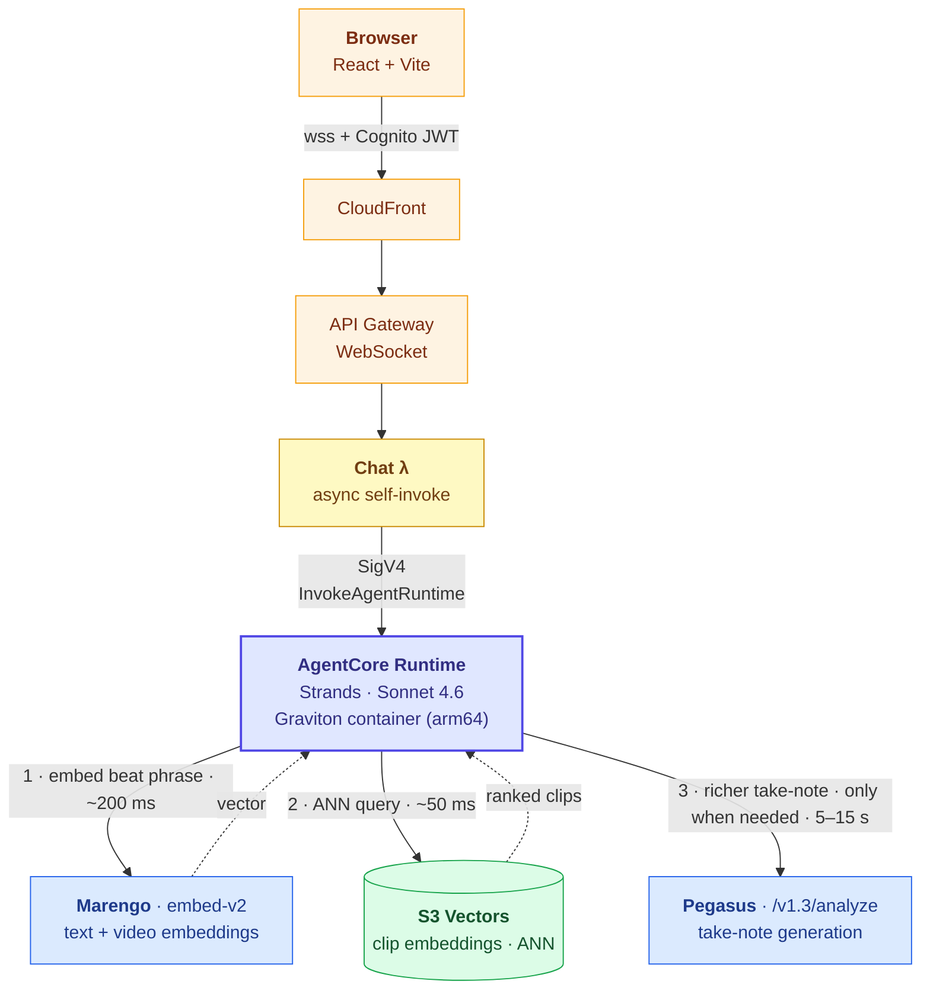
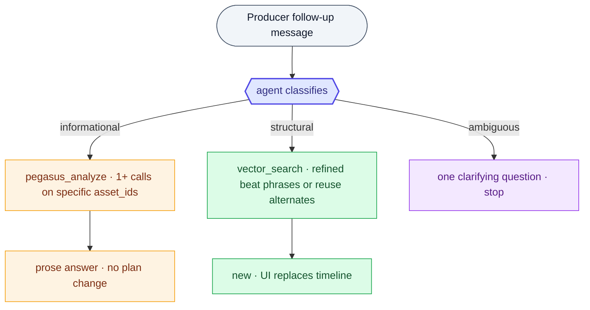

# Building Agentic Highlight-Reel Pipelines on AWS

**An AgentCore × TwelveLabs reference architecture**

---

## 1 · Executive summary

The producer's "find me the highlights" task collapses from hours to
seconds when the agent can read the indexed library directly. Bedrock
AgentCore plus TwelveLabs Marengo and Pegasus is the AWS-native path to
that workflow without writing custom retrieval, custom ranking, or
custom generative-vision code.

The retrieval layer is embedding-RAG over video clips: Marengo segments
and embeds every clip at ingest, the vectors land in an S3 Vectors
index, and the agent embeds each producer beat into the same vector
space and runs an ANN query. There is no custom cache, no curated
taxonomy of moods or roles, no two-tier dispatch logic. One retrieval
primitive returns ranked clips with timecodes, and the alternates
producers can swap into the EDL are the natural shape of an ANN result.

The first cut is not the final cut. After the agent emits the initial
EDL, the producer can keep talking to it. Follow-up turns reuse the
same AgentCore Runtime session and embed the current plan inline, so
the agent always reasons over the live state of the cut. The agent
classifies each follow-up as informational ("what's happening in scene
2 clip 1?"), structural ("swap that for something more kinetic"), or
ambiguous, and reaches for `pegasus_analyze` to ground answers about
specific clips when retrieval similarity alone cannot.

The architecture generalizes from highlights to sports recaps, ad
cutdowns, social shorts, and newsroom workflows with no agent-runtime
changes.

---

## 2 · The problem

### 2.1 What a producer actually does

Today, "build me a 60-second action highlight reel" is a multi-hour task:

1. Scrub the source footage (or trust someone else's notes).
2. Find candidate clips by memory, filename, or a brittle search.
3. Pick in/out points.
4. Stitch and review.
5. Iterate.

The shared property of every minute spent: the producer is the only
component in the system that has watched the video. Everything else
(filenames, transcripts, manual logs) is a proxy for what's actually on
screen.

### 2.2 What "good" looks like

The agent should be able to ask the library: *"clips that look like a
celebration after a tense moment"*, and get clip-level results with start
and end timecodes, ranked by semantic match, with a one-line *why*. That
is what Marengo and Pegasus return.

---

## 3 · Architecture overview

### 3.1 Component map



### 3.2 One retrieval primitive, not two tiers

The agent has one retrieval primitive: vector similarity over a Marengo
embedding index hosted on S3 Vectors. Producer beats become text
embeddings via Marengo's text encoder; the index returns ranked clips
by cosine similarity. Pegasus is reserved for take-note generation when
a beat needs prose, not retrieval.

| Tool | p50 latency | Purpose |
|---|---|---|
| `vector_search` (embed + ANN) | ~250 ms | Ranked clip-level retrieval per beat |
| `pegasus_analyze` | 5–15 s | Look at a specific clip and answer a question about what it visibly contains. Used to ground informational follow-ups in dialogue, not during the first cut. |
| `list_tl_indexes` | <1 s | Discovery, skipped once the index is in context |

A typical six-beat rough cut runs every beat through `vector_search` in
parallel and assembles the EDL in a single agent turn:


There is no two-tier dance, no cache miss handling, no fall-through
logic. Every retrieval is a vector query; every result is ranked; the
alternates payload is the natural shape of an ANN response, not a
bolt-on.

### 3.3 Why AgentCore (not Bedrock Agents)

| Concern | Bedrock Agents | AgentCore |
|---|---|---|
| Long-running multi-step tool calls | 60 s integration cap | Async invoke; multi-minute runs |
| Framework choice | Bedrock-flavored | Strands · CrewAI · any |
| Tool catalog | OpenAPI action groups | MCP via Gateway (or inline) |
| Identity | IAM only | Cognito JWT end-to-end through Gateway |
| Compute | Managed | Customer container (arm64 Graviton) |

For the highlight workflow specifically, a 6-beat rough cut routinely
needs 8–15 tool calls. The runtime needs to support a 2–3 minute envelope
without architectural gymnastics. AgentCore does; Bedrock Agents requires
async-self-invoke workarounds.

### 3.4 Conversation mode

The first cut is rarely the final cut. The agent keeps the same
AgentCore Runtime session across follow-up turns, so producer messages
after the initial brief reuse the conversation context the runtime
already holds. Each follow-up user message also embeds the live EDL
inline as `[CURRENT PLAN] <plan>{...}</plan> [FOLLOWUP] {message}`, so
the agent always reasons over the current state of the cut even if
session memory lapses.

Every follow-up is classified into one of three shapes before the
agent decides which tools to call:

| Shape | Producer intent (examples) | Tools | Reply |
|---|---|---|---|
| **Informational** | "What's visually happening in scene 2 clip 1?" · "Do scenes 1 and 4 feel similar?" · "Is the celebration shot bright enough?" | `pegasus_analyze` on the clip's `asset_id`, grounding the answer in what the model actually sees on screen | Plain prose. No `<plan>` block. |
| **Structural** | "Swap that for something more kinetic" · "Drop scene 3" · "Extend the cut to 45 seconds" · "Use the rank-2 alternate on scene 4 clip 1" | `vector_search` for fresh candidates, plus existing alternates already on the plan | One or two sentences explaining the change, then a fresh full `<plan>` |
| **Ambiguous** | (could be either) | none | A single clarifying question |



The UI surfaces this as a chat thread that replaces the script input
once the first plan exists. Agent text deltas stream into the latest
assistant message as they arrive; the `<plan>` block is hidden from
the chat view and extracted onto the timeline when the turn finishes.
A "new cut" button discards the conversation and starts a fresh
session.

---

## 4 · Embedding-RAG for video clips

### 4.1 What we keep from text RAG, and what changes

Standard text RAG on AWS is well understood: chunk the corpus at index
time, compute embeddings, store the vectors in a managed index (S3
Vectors, OpenSearch, Bedrock Knowledge Bases), and at query time embed
the user's question and retrieve the top-K nearest chunks. The shape of
the architecture for video is the same. The two pieces that change are:

- **The chunker is Marengo.** Marengo segments a video into clip-level
  units automatically (typically 5–10 s shots, aware of cuts and
  motion). There is no manual chunking decision to make.
- **The embedding model is multimodal.** Marengo embeds both video
  clips and text queries into the same vector space. The producer's
  beat ("kinetic action with crowd reaction") becomes a vector that is
  natively comparable to every clip in the index.

The retrieval primitive is exactly what an AWS practitioner expects:
ANN lookup against a managed vector index.

### 4.2 The shape of an indexed clip

At ingest time, every asset is segmented and embedded by Marengo. Each
clip becomes one row in the S3 Vector index:

| Field | Source |
|---|---|
| `id` | `<asset_id>:<start_seconds>:<end_seconds>` |
| `vector` | Marengo clip embedding (1024-dim float) |
| `asset_id` | TwelveLabs asset id |
| `knowledge_store_id` | Filterable attribute for KS scoping |
| `start_time`, `end_time` | Clip boundaries inside the source asset |

The clip-level granularity is what makes alternates work cheaply: rank
1 is the primary, ranks 2–5 are sibling clips by definition similar in
the embedding space, and they already carry their own timecodes.

### 4.3 Building the index

The index is built by an ingestion script run once per knowledge store:

```mermaid
flowchart LR
    Script["<b>scripts/ingest_vectors.py</b><br/>ks_&lt;id&gt;"]
    List["List assets in KS<br/>/v1.3/knowledge-stores/{ks}/items"]
    Embed["<b>Marengo /embed-v2/tasks</b><br/>video-mode · per-clip vectors"]
    Batch["PutVectors · batched<br/>id, vector, asset_id, start, end"]
    Index[("<b>S3 Vectors</b><br/>tl-agentcore-clips")]

    Script --> List
    List --> Embed
    Embed --> Batch
    Batch --> Index

    classDef script fill:#fef9c3,stroke:#ca8a04,stroke-width:1px,color:#713f12
    classDef step   fill:#dbeafe,stroke:#2563eb,stroke-width:1px,color:#1e3a8a
    classDef hero   fill:#e0e7ff,stroke:#4f46e5,stroke-width:2px,color:#312e81
    classDef store  fill:#dcfce7,stroke:#16a34a,stroke-width:1px,color:#14532d

    class Script script
    class List,Batch step
    class Embed hero
    class Index store
```



Marengo's embedding job returns one vector per segmented clip; a
typical 10-minute asset yields 60–120 clip vectors. Throughput is
gated by Marengo's embedding endpoint (~10 minutes of video per
minute of wall-clock) and S3 Vectors `PutVectors` batches of 500.

A single agent tool reads the index at runtime: `vector_search(query_text,
knowledge_store_id, k=5)`. It embeds the query via Marengo's text
encoder and runs an ANN query against the S3 Vector index, scoped by
`knowledge_store_id`.

### 4.4 Why this lands cleanly

- **One retrieval primitive.** No cache-vs-live tier dance. Every beat
  is a vector query; every response is a ranked list.
- **Alternates are free.** ANN returns top-K by construction. Rank 1 is
  the primary; ranks 2–5 are the alternates payload the UI hands to the
  producer. No second Marengo pass per beat.
- **No curated taxonomy.** There is no enum of mood tags or role hints
  to maintain; the model interprets the beat phrase as written.
  *"Celebration after a tense moment"* and *"quiet vineyard wide
  shot"* both work without a vocabulary update.
- **Native AWS retrieval surface.** S3 Vectors is the AWS-managed
  vector index pattern. The same primitive can back a Bedrock
  Knowledge Base later (§9).

### 4.5 Latency, end-to-end

| Stage (per beat) | Latency |
|---|---|
| Marengo text encode of beat phrase | ~200 ms |
| S3 Vectors ANN (k=5) | ~50 ms |
| `pegasus_analyze` for take-note | 5–15 s, only when needed |

A 6-beat reel: ~1.5 s of retrieval in parallel + agent overhead +
optional Pegasus per beat. End-to-end, an interactive request lands in
under 15 s when no take-notes are required, and under 60 s when every
beat needs Pegasus.

---

## 5 · The agent tool catalog

Detailed contract for each tool. Source of truth: `agent/tl_agentcore/agent.py`.

### 5.1 `vector_search(query_text, knowledge_store_id, k=5)`

The retrieval primitive. Embeds `query_text` through Marengo's text
encoder, then runs an ANN query against the S3 Vector index, filtered
to clips whose `knowledge_store_id` matches. Returns `k` clips ordered
by descending cosine similarity, each with `asset_id`, `start_time`,
`end_time`, and a similarity score.

The agent calls `vector_search` once per beat in parallel. Rank 1 is
the primary clip on that beat; ranks 2–5 are emitted as `alternatives`
on the EDL clip object, so a producer can swap any pick for a
similarly-ranked option in the UI without re-running the agent.

### 5.2 `pegasus_analyze(target, prompt)`

Look at a specific clip and answer a question about what it visibly
contains: subject, action, framing, mood, on-screen text, dialogue. The
agent reaches for this tool in conversation mode when the producer asks
something the embedding rank ordering cannot answer ("what's happening
in scene 2 clip 1?", "do these two shots feel similar?"). Pass the
clip's `asset_id` as `target` and the question as `prompt`; the response
is grounding text the agent paraphrases back to the producer.

### 5.3 `list_tl_indexes()`

Discovery. Skipped when the index is already in context.

---

## 6 · Deployment recipe

Terraform-only deployment. The stack under `infra/` provisions, end-to-end:

- **Runtime.** `aws_bedrockagentcore_agent_runtime` running the Strands
  agent container (arm64 Graviton, pulled from ECR by tag), with a
  versioned `aws_bedrockagentcore_agent_runtime_endpoint` for callers.
- **Vector index.** S3 Vectors bucket holding one Marengo embedding per
  segmented clip, attributed with `asset_id`, `knowledge_store_id`,
  `start_time`, and `end_time`. The agent's `vector_search` tool
  filters by `knowledge_store_id` so a single index serves multiple KSs.
- **Edge + transport.** CloudFront fronts an S3 bucket of built UI
  assets plus two API Gateway origins: a WebSocket for the chat lambda
  that invokes the runtime, and an HTTP API for the `tl_proxy` lambda
  that forwards `/tl/*` browser calls to the TwelveLabs API.
- **Identity.** Cognito User Pool with `allow_admin_create_user_only =
  true`: no self-registration, and admins onboard every user via
  `aws cognito-idp admin-create-user`. An `admins` group surfaces the
  admin role to the UI as a claim. The Cognito JWT flows end-to-end
  from browser through CloudFront, through the WebSocket and HTTP APIs,
  and into the lambdas that verify it before invoking the runtime.
- **Secrets.** The TwelveLabs API key lives in Secrets Manager; both
  the runtime container and the `tl_proxy` lambda read it at startup.
- **Gateway.** `gateway.tf` is documented but not enabled in this
  reference implementation. A future evolution moves the agent tools
  out of the runtime container into MCP-served lambdas behind
  AgentCore Gateway, so the tool catalog is administered as
  infrastructure instead of code.

```bash
cd infra
terraform init
terraform apply -var="tl_api_key=tlk_..." -var="seed_admin_email=you@example.com"
```

Build and push the agent container:

```bash
./build-agent.sh   # docker buildx build --platform linux/arm64 …
```

Build the vector index for an existing knowledge store:

```bash
python scripts/ingest_vectors.py ks_<id>
```

### 6.1 Implementation notes

- **AgentCore Runtime is arm64-only.** linux/amd64 images get rejected at
  `CreateAgentRuntime` with `Architecture incompatible`.
- **API Gateway WebSocket has a 30 s integration cap.** It cannot be
  raised, which forces an async self-invoke pattern in the chat lambda.
- **Async lambda retry produces phantom duplicate runs.**
  `aws_lambda_function_event_invoke_config { maximum_retry_attempts = 0 }`
  is mandatory; otherwise every timeout fires the agent twice.
- **`runtime-session-id` must be ≥33 characters.** Short ids are rejected;
  pad them before invoking.
- **AWS provider ≥6.30** is required for `aws_bedrockagentcore_*` resources.
- **AgentCore Runtime → custom HTTP timeouts.** AWS SDK default
  socketTimeout (180 s) is below the 300 s lambda cap. Set NodeHttpHandler
  `socketTimeout: 280_000` explicitly.
- **S3 Vectors filterable metadata is bounded.** Per-vector metadata is
  capped; keep the attribute set to the four fields the agent actually
  filters or returns (`asset_id`, `knowledge_store_id`, `start_time`,
  `end_time`). Anything richer belongs in a separate metadata store.

---

## 7 · Generalization

The architecture is vertical-agnostic by design. To switch use cases,
only two things change:

1. **The system prompt:** what the agent is being asked to assemble
   (highlight reel → news recap → ad cutdown → channel block).
2. **The beat-extraction step:** how the brief is decomposed into the
   per-beat phrases that go into `vector_search`. The clip index stays
   the same; only the queries change shape.

Worked examples:

- **Sports recaps.** Beats become narrative-arc phrases ("decisive
  play", "momentum shift", "crowd reaction") instead of mood phrases.
  No index change; the same Marengo embeddings serve the new queries.
- **Social cutdowns.** Beats bias short, kinetic, opening-strong
  ("hook in first second", "vertical-safe close-up", "punchline cut").
  Same index.
- **Newsroom dossiers.** Beats are entity- and chronology-keyed
  ("the senator at the podium", "wide of the crowd outside",
  "anchor handoff"). Same index.
- **FAST channel programming.** A coordinator prompt builds a sequence
  of rough cuts (one per show in the schedule) and a separate scheduler
  agent assembles the channel. The vector index is shared; only the
  orchestration above it differs.

The TwelveLabs models (Marengo and Pegasus) do not change. The agent
runtime (AgentCore) does not change. The S3 Vector index does not
change. Only the prompt and the beat-extraction shape.

---

## 8 · Reference implementation

The companion repository contains:

- `agent/`: Strands agent and tools (Python, packaged into the arm64
  AgentCore Runtime container)
- `ui/`: React + Vite SPA with the Rough Cut and Agent tabs, the live
  architecture diagram, and a Playwright E2E suite in `ui/e2e/`
- `lambda/`: chat lambda (WebSocket → InvokeAgentRuntime) and
  `tl_proxy` lambda (the browser's `/tl/*` forwarder)
- `infra/`: Terraform for one-command deployment (S3 Vectors bucket,
  AgentCore Runtime + endpoint, Cognito, CloudFront, two API Gateways,
  lambdas)
- `scripts/`: `ingest_vectors.py` (Marengo embedding → S3 Vectors) and
  `setup_test_fixtures.sh` (creates the E2E knowledge store + index)

A reader can `terraform apply` and have a working endpoint in roughly 15
minutes, plus the embedding-ingestion time for whatever KB they bring.

---

## 9 · Where this goes next

| Follow-on | Status |
|---|---|
| Pegasus 1.5 on Bedrock Marketplace | Pending availability |
| Bedrock Knowledge Base backed by the same S3 Vector index | Roadmap |
| Sports-recap variant | Planned |
| Newsroom dossier variant | Planned |
| FAST-channel programming variant | Planned |
| Open-source MCP server for TwelveLabs primitives | Roadmap |
| Typed `attach_video_knowledge` primitive in AgentCore | Roadmap |

---

*Authors: TwelveLabs and AWS.*
