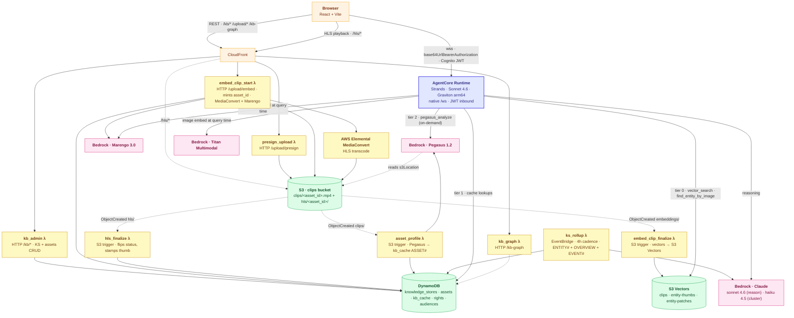
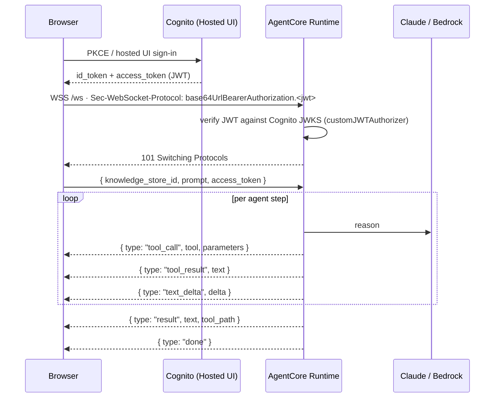
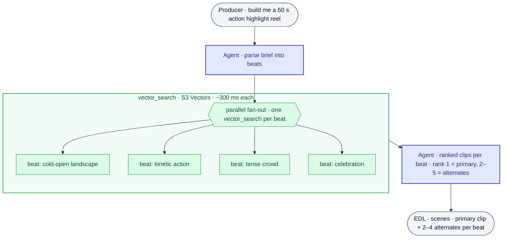
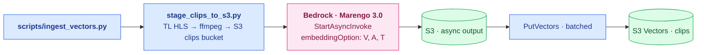
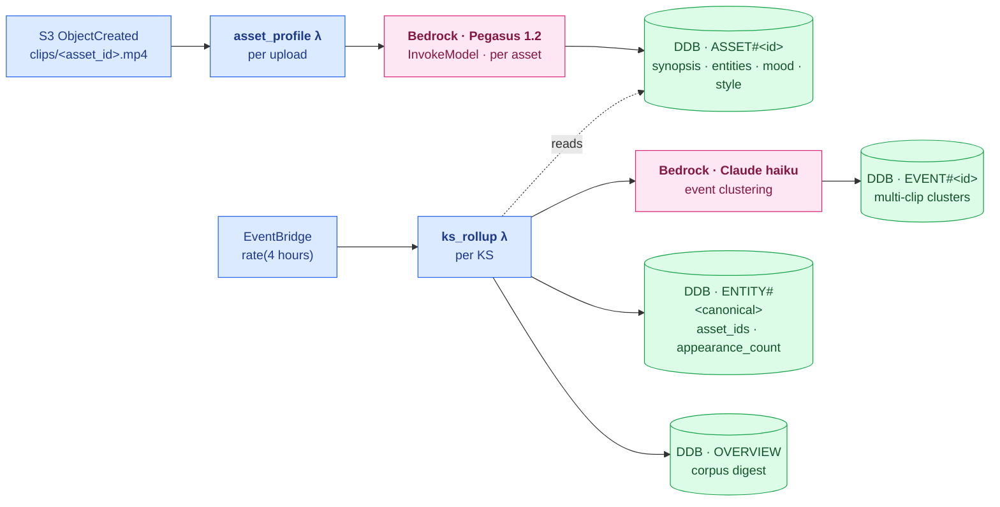
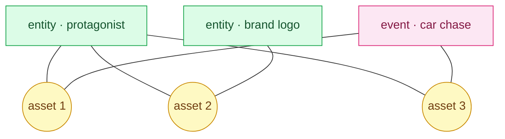

# Building an Agentic Video Knowledge Studio on AWS

**A Bedrock AgentCore × Marengo / Pegasus / Titan reference architecture**

## 1 · Introduction

This paper describes a fully AWS-native pattern for building agentic
systems on top of a video corpus. The producer-facing surface is
conversational: a brief in natural language returns an Edit Decision
List (EDL) of clips; a follow-up question gets a grounded prose answer;
a *"find me more of this person"* finds them across the entire library.
Underneath, **every model and every store lives inside the customer's
AWS account**. Marengo 3.0 (clip embeddings), Pegasus 1.2 (clip
analysis), Titan Multimodal (image embeddings for Re-ID), and Claude 4
(reasoning + clustering) are all invoked through Bedrock — the
TwelveLabs models via Bedrock Marketplace, billed through the customer's
AWS account with no separate SaaS sign-up. ANN retrieval is S3 Vectors.
The agent runs on Bedrock AgentCore Runtime, which terminates the
browser WebSocket **directly** — no chat-lambda hop, no API Gateway in
the live path. The customer-deployed surface is a Strands agent
container (arm64), six support lambdas (`kb_admin`, `kb_graph`,
`presign_upload`, `embed_clip_start`, `asset_profile`, `ks_rollup`), a
SageMaker Async Inference Endpoint for the Re-ID worker, a MediaConvert
HLS transcode pipeline, and the S3 buckets / DynamoDB tables that hold
the clips, the vectors, and the asset registry. **The full
"upload-to-ready" pipeline is automatic** — no operator scripts
required between dropping an MP4 in the UI and the agent having a
Pegasus profile + cross-asset entity graph for it. Nothing — not even the knowledge-store catalog
— talks to api.twelvelabs.io on the live path.

The worked example is a **Rough Cut / Highlight Reel studio**: a
producer types a brief in natural language and the agent returns an
EDL — the ordered run of clips with HH:MM:SS in/out times and 2–4
ranked alternates per clip that an editor can swap into the cut. The
same composition applies to any vertical with an indexed video corpus
and beat-structured queries (sports highlight extraction, surveillance
forensics, ad-creative search, content-rating triage). The index, the
runtime, the tool catalog, and the knowledge graph are identical
across verticals — only the system prompt and the beat shape change.

What is new compared to a "single retrieval primitive" agent is the
**knowledge graph that sits behind the corpus**. Pegasus runs once per
asset at ingest and writes a structured profile to DynamoDB. Entities
mentioned across assets (people, animals, brands, places, named
objects) are aggregated into a cross-asset graph. A real CV pipeline
— Grounding DINO open-vocab detection, DeepSORT tracking, Titan
Multimodal patch embeddings — runs on a SageMaker Async Inference
Endpoint and writes per-patch Re-ID vectors back to S3 Vectors so the
agent can answer *"find clips with this person"* from a thumbnail.
Multi-clip events are clustered with Claude haiku and persisted as
EVENT# rows. The agent's tool catalog is tiered so the cheap
structured lookups (DynamoDB cache) answer the common questions first,
the embedding-space ANN runs only when text-grounded retrieval is
needed, and the expensive Pegasus calls only fire when neither cache
nor embeddings can answer.

The first EDL is rarely the final cut. Conversation mode preserves the
runtime session across follow-up turns and embeds the live plan inline
as `[CURRENT PLAN] <plan>{...}</plan> [FOLLOWUP] {...}`, so the agent
always reasons over the current state of the cut. The browser
WebSocket is now the AgentCore Runtime's native `/ws` endpoint
(authenticated with a Cognito JWT carried in the
`Sec-WebSocket-Protocol` subprotocol). Each agent yield becomes a JSON
text frame — `tool_call`, `tool_result`, `text_delta`, `result` — so
the producer sees the agent reason in wall-clock order rather than as
a 60-second spinner.

---

## 2 · The problem

### 2.1 What a producer actually does

"Build me a 60-second action highlight reel" is normally a multi-hour
task:

1. Scrub the source footage (or trust someone else's notes).
2. Find candidate clips by memory, filename, or a brittle search.
3. Pick in/out points.
4. Stitch and review.
5. Iterate.

The shared property of every minute spent: the producer is the only
component in the system that has watched the video. Everything else —
filenames, transcripts, manual logs — is a proxy for what is actually
on screen.

### 2.2 What "good" looks like

The agent should be able to ask the library: *"clips that look like a
celebration after a tense moment, where the protagonist appears"*, and
get clip-level results with start and end timecodes, ranked by
semantic match, with a one-line *why* — and a list of every other clip
that protagonist appears in. That is what Marengo, Pegasus, Titan, and
the entity graph collectively answer.

---

## 3 · Architecture overview

The deployment splits cleanly into a **live tier** that serves the
producer's WebSocket session, and an **offline tier** of ingest
pipelines run once per knowledge store. The agent only ever *reads*
the indexes it relies on; writing them is the job of the offline
pipelines.

### 3.1 Component map

### 3.2 Native AgentCore WebSocket

AgentCore Runtime now exposes a native WebSocket endpoint at
`wss://bedrock-agentcore.<region>.amazonaws.com/runtimes/<arn>/ws`.
Inside the container, the Strands app registers an `@app.websocket`
handler that AgentCore's framework wires onto `/ws`. The browser
connects directly to that URL with a Cognito access token; the runtime
itself terminates the handshake, verifies the JWT against the user
pool's JWKS, and only then promotes the connection.

Browsers cannot set custom headers on a WebSocket handshake, so the
token is carried by the `Sec-WebSocket-Protocol` subprotocol trick:
two subprotocols are advertised on `WebSocket(url, [...])`:
`base64UrlBearerAuthorization.<base64url(jwt)>` (the actual token,
base64url-encoded, no padding) and the sentinel
`base64UrlBearerAuthorization` (which the runtime negotiates back to
complete the handshake).

What is **not** in this diagram any more: the chat lambda, the
API-Gateway WebSocket, and the chat lambda's async self-invoke
workaround for API-Gateway's 30-second integration cap. Both are
removed from the live path; the runtime handles long-running turns
(up to its configured `IdleRuntimeSessionTimeout`, defaulted to 15
minutes) natively.

The same JSON wire format is used by an `@app.entrypoint` handler on
`/invocations` for non-browser callers (a CLI, an EKS workload). One
shared `_stream_events()` async generator yields the events both
endpoints emit; the only delta is the framing (SSE `data: {...}\n\n`
vs WS text frame).

### 3.3 Tiered tool catalog

The agent runs Strands as an in-container reasoning loop over a
**tiered tool catalog**. Tiering is what keeps per-turn latency
predictable: cheap structured lookups answer the questions that don't
need a Bedrock model, and the expensive Bedrock calls only fire when
the cheap tools cannot.

| Tier | Tool family | Backing store | p50 latency | When the agent uses it |
|---|---|---|---|---|
| **0 · retrieval** | `vector_search`, `find_entity_by_image` | S3 Vectors (clips · entity-thumbs · entity-patches) | 250–400 ms per call | Beat-phrase → clip rank; image → similar-entity rank |
| **1 · cache** | `get_kb_overview`, `list_kb_assets`, `lookup_asset_profile`, `list_kb_events`, `lookup_event`, `find_cached_entity_appearances`, `list_cached_entities`, `lookup_rights`, `list_audiences`, `lookup_audience` | DynamoDB (`kb_cache`, `rights`, `audiences`) | 10–40 ms | "What's in this KS?", "who appears in asset X?", "what events span the corpus?", rights / audience filters |
| **2 · analyze** | `pegasus_analyze` | Bedrock Pegasus 1.2 → S3 clips | 3–15 s | Ground a follow-up in what the model actually sees on screen |

Tier 1 is the workhorse on conversational follow-ups. *"Who else
appears in this asset?"* and *"is this clip in our rights window?"*
are 40 ms DynamoDB roundtrips against rows that were precomputed at
ingest. Tier 0 is the workhorse on the initial brief: a six-beat reel
fans out six parallel `vector_search` calls and lands every beat in
under 400 ms. Tier 2 only fires when the embedding rank ordering
cannot answer the question — *"what's visually happening in scene 2
clip 1?"*, *"do these two shots feel similar?"*.

An earlier edition of this paper documented a fourth "delegation" tier
that wrapped TwelveLabs `/v1.3` endpoints behind a `tl_proxy` lambda
for capabilities Tiers 0–2 didn't cover. That tier has been **removed**.
Everything the agent does now happens against AWS-native stores, with
every model invoked through Bedrock under the customer's IAM. There is
no longer a TwelveLabs API key in Secrets Manager and no longer a
`tl_proxy` lambda in the stack. If the customer wants a capability the
Bedrock-side primitives don't yet cover, the path is to **promote it
into a tier**: bake a precomputed answer into Tier 1 (a DynamoDB row),
add an S3 Vectors index to Tier 0, or write a domain-specific Pegasus
prompt template in Tier 2.

### 3.4 The two indexes and the two tables

| Store | Schema | Written by | Read by |
|---|---|---|---|
| S3 Vectors · `clips` | `(asset_id, start_sec, end_sec, modality)` → 512-dim Marengo embedding | `ingest_vectors.py` | `vector_search` |
| S3 Vectors · `entity-thumbs` | `(canonical_name)` → 1024-dim Titan image embedding (a thumbnail of the entity) | `ingest_entity_thumbs.py` | `find_entity_by_image` (pragma path) |
| S3 Vectors · `entity-patches` | `(asset_id, track_id, frame_t)` → 1024-dim Titan embedding of a tracked-detection crop | Entity Re-ID Step Functions → SageMaker Async Inference Endpoint | `find_entity_by_image` (proper path) |
| DynamoDB · `kb_cache` | `pk=ks#<id>`, `sk ∈ {OVERVIEW, ASSET#<id>, ENTITY#<canonical>, EVENT#<id>}` | `asset_profile` λ (S3-triggered, per-upload) writes `ASSET#`; `ks_rollup` λ (EventBridge, 4h) writes `ENTITY#`, `OVERVIEW`, `EVENT#`. Manual scripts `ingest_kb_cache.py` + `build_event_groups.py` still exist for one-shot bootstrap or backfill. | Tier-1 cache tools, `kb_graph` λ |
| DynamoDB · `rights` | `asset_id` → window, region, license | `seed_rights.py` | `lookup_rights` |
| DynamoDB · `audiences` | `segment_id` → cohort, channel, preferences | `seed_audiences.py` | `list_audiences`, `lookup_audience` |

The agent never writes to any of these. The clean separation between
*live read* and *offline write* is what makes the agent's per-turn
latency a function of retrieval and reasoning only, and lets one
knowledge store back an unbounded number of sessions.

---

## 4 · Live tier — the agent

### 4.1 `vector_search`: one tool, three modalities

The retrieval primitive at the agent's tool surface. Three steps inside
one tool call:

1. **Embed the query** once via Bedrock Marengo text encoder
   (`inputType: "text"`, sync `InvokeModel`).
2. **Compute modality routing weights.** Three short anchor texts —
   one per modality — are embedded the first time the container
   serves a request and cached for its lifetime. For each query, take
   cosine similarity between the query embedding and each anchor,
   scale by `α = 10`, and softmax:
   `(w_v, w_a, w_t) = σ(α · sim(q, [AncV, AncA, AncT]))`. A dialogue
   query lands a high weight on transcription; a framing query lands
   a high weight on visual.

   The anchors are tuned for highlight-reel / film vocabulary. They
   only need to be semantically *distinct* for the softmax to route
   stably, but anchors closer to the domain of incoming queries give
   tighter routing on borderline phrases. Re-tune the three strings
   when targeting a different domain (surveillance, sports broadcast,
   security).

3. **Run three parallel ANN queries** against the S3 Vectors index,
   each filtered by `knowledge_store_id` AND `embedding_option`
   (one filter value per modality). Over-fetch (top-25 per modality)
   so the fusion has signal, then score-fuse:
   `score(s) = Σ_m w_m · sim(q, E_m(s))`. Deduplicate by
   `(asset_id, start_sec, end_sec)` and return the top-k clips.

Each returned clip carries `asset_id`, `start_time`, `end_time`,
`score`, `distance`, and a `dominant_modality` field naming whichever
of visual/audio/transcription contributed the most signal. The tool
also returns the per-query routing weights so a developer can audit
why a beat landed where it did.

The agent calls `vector_search` once per beat in parallel. Rank 1 is
the primary clip on that beat; ranks 2–5 are emitted as `alternatives`
on the EDL clip object, so a producer can swap any pick for a
similarly-ranked option in the UI without re-running the agent.

### 4.2 Tier 1 — the structured knowledge cache

The agent's tier-1 tools read **precomputed structured rows** out of
DynamoDB. They never call a Bedrock model on the live path. The
underlying rows are written by two background lambdas: `asset_profile`
(S3-triggered, runs Pegasus per upload, writes one `ASSET#<asset_id>`
row) and `ks_rollup` (EventBridge every 4 h, aggregates entities +
overview + event clusters across the KS). See §5.2 for the full
pipeline diagram.

| Tool | Returns | Backing row |
|---|---|---|
| `get_kb_overview(ks_id)` | One-paragraph corpus digest + top moods + top entities + top events | `pk=ks#<id>, sk=OVERVIEW` |
| `list_kb_assets(ks_id)` | `[asset_id, title, one_liner, mood_tags, role_hint, visual_style]` per asset | `pk=ks#<id>, sk=ASSET#<id>` |
| `lookup_asset_profile(ks_id, asset_id)` | The full Pegasus profile JSON for one asset (synopsis, named entities, mood arc, visual style) | `pk=ks#<id>, sk=ASSET#<asset_id>` |
| `list_cached_entities(ks_id, kind?)` | All cross-asset entities (people, animals, brands, places, named objects) with appearance counts | `pk=ks#<id>, sk=ENTITY#*` |
| `find_cached_entity_appearances(ks_id, name)` | Every asset (and clip range) where this entity appears, sourced from the cross-asset aggregation | `pk=ks#<id>, sk=ENTITY#<canonical>` |
| `list_kb_events(ks_id)` | Multi-clip event clusters with cluster size + participating assets | `pk=ks#<id>, sk=EVENT#*` |
| `lookup_event(ks_id, event_id)` | Single event: description, mood signature, member clips | `pk=ks#<id>, sk=EVENT#<id>` |
| `lookup_rights(asset_id, region?)` | Rights window + license + restrictions for an asset | `pk=rights#<asset_id>` |
| `list_audiences()` / `lookup_audience(segment_id)` | Marketing-style audience cohorts and segment profiles | `pk=audience#<segment_id>` |

A typical conversational pattern combines them with Tier 0:
*"Build me a montage of every scene this character is in"* hits
`find_cached_entity_appearances` (Tier 1, ~40 ms) to enumerate the
asset/clip pairs, then `vector_search` (Tier 0) to expand each pair's
neighborhood. *"Are scenes 1 and 4 in our broadcast rights for
EMEA?"* hits `lookup_rights` on each asset_id. The agent never has to
re-derive these from Pegasus.

### 4.3 Tier 2 — `pegasus_analyze`

Look at a specific clip and answer a question about what it visibly
contains: subject, action, framing, mood, on-screen text, dialogue.
The agent reaches for this tool when the producer asks something the
embedding rank ordering and the structured cache both cannot answer
("what's happening in scene 2 clip 1 specifically?", "do these two
shots feel similar?"). Pass the clip's `asset_id` as `target` and the
question as `prompt`; the response is grounding text the agent
paraphrases back to the producer.

This routes to **Bedrock Pegasus 1.2** reading
`s3://CLIPS_BUCKET_NAME/clips/<asset_id>.mp4` directly — no URL
download, the model reads the S3 object with the runtime's IAM role.
The agent only invokes Bedrock; there is no TwelveLabs HTTP path on
the live route any more.

### 4.4 `find_entity_by_image`: image-in, clips-out

A different shape of query: the producer drops in an image of a
person, animal, brand mark, or place, and asks *"find clips where this
appears across the library"*. Two implementations live behind one
tool surface.

- **Pragma path** (Phase 3 pragma). The query image is embedded with
  **Bedrock Titan Multimodal Embeddings G1** (1024-dim) and used as
  the query vector against the `entity-thumbs` S3 Vector index. The
  `entity-thumbs` index is populated at ingest by extracting one
  representative frame per cached entity (`ingest_entity_thumbs.py`),
  embedding it with Titan, and writing one row per canonical entity.
  Retrieval is one-shot: top-k entities by cosine similarity, and the
  agent expands them to clip appearances via Tier 1.

- **Proper path** (Phase 3-proper). Each asset has been run through a
  real CV pipeline at ingest (see §5.3): Grounding DINO open-vocab
  detection → DeepSORT tracking → per-track crops → Titan Multimodal
  embedding per crop. The `entity-patches` S3 Vector index stores one
  row per `(asset_id, track_id, frame_t)`. The query image embeds the
  same way and retrieves nearest patches across **every track in
  every asset** — so a face the producer has never seen the agent
  describe in prose can still be matched directly from pixels.

Both paths return clip-level results with timestamps; the agent
chooses which to call based on whether the deployment has the proper
CV index populated.

### 4.5 Conversation mode

The first cut is rarely the final cut. The agent keeps the same
AgentCore Runtime session across follow-up turns, and each user
message embeds the live EDL inline as `[CURRENT PLAN]
<plan>{...}</plan> [FOLLOWUP] {message}`, so the agent always reasons
over the current state of the cut even if session memory lapses.

Every follow-up is classified into one of three shapes before the
agent decides which tools to call:

| Shape | Producer intent (examples) | Tools | Reply |
|---|---|---|---|
| **Informational** | "What's visually happening in scene 2 clip 1?" · "Who appears in scene 4?" · "Is the celebration shot bright enough?" | Tier 1 (`lookup_asset_profile`, `find_cached_entity_appearances`) when the answer is in the cache; Tier 2 (`pegasus_analyze`) when it needs grounded vision | Plain prose. No `<plan>` block. |
| **Structural** | "Swap that for something more kinetic" · "Drop scene 3" · "Extend the cut to 45 seconds" · "Use the rank-2 alternate on scene 4 clip 1" | Tier 0 (`vector_search`) for fresh candidates; existing alternates already on the plan | One or two sentences explaining the change, then a fresh full `<plan>` |
| **Ambiguous** | (could be either) | none | A single clarifying question |

The UI surfaces this as a chat thread that replaces the script input
once the first plan exists. Agent text deltas stream into the latest
assistant message as they arrive; the `<plan>` block is hidden from
the chat view and extracted onto the timeline when the turn finishes.
A "new cut" button discards the conversation and starts a fresh
session.

---

## 5 · Offline tier — ingest pipelines

Five offline pipelines populate the indexes and tables the live tier
reads. None of them run on the per-turn path; each is operator-driven
(a script invocation or a Step Functions execution).

### 5.1 Vector ingest — Marengo embeddings

Source video is mirrored to `s3://<stack>-clips/clips/<asset_id>.mp4`
either by `stage_clips_to_s3.py` (which pulls TL HLS manifests through
ffmpeg) or by the producer's `presign_upload` flow (browser PUTs
directly to S3 via a short-lived signed URL). Bedrock Marengo
StartAsyncInvoke runs against that S3 object with
`embeddingOption: ["visual","audio","transcription"]`. Async output
lands at `embeddings/<inv_id>/output.json`. The script reads it, keeps
clip-scope segments, and writes one S3 Vectors row per
`(clip, modality)` via batched `PutVectors`. A 10-minute trailer with
narration produces 180–360 vectors; a 1000-asset catalog produces
~200k rows.

The same index supports two metadata schemas (`asset_id` from this
repo's ingestor, `mimir_id` from the mimir indexing pipeline) and two
index layouts (per-modality indexes — the default — or a single index
with an `embedding_option` metadata filter). The agent's
`_query_one_modality` resolver detects which is configured and routes
accordingly.

### 5.2 kb_cache ingest — Pegasus profile + cross-asset entities

This pipeline is **fully automatic** now. Two lambdas split the work
between per-asset (cheap, hot) and cross-asset (expensive, batchable):

`asset_profile` fires the moment a new MP4 lands in `clips/`. It calls
Bedrock Pegasus 1.2 with a structured-output prompt asking for
`{title, one_liner, mood_tags, primary_subjects, visual_style,
role_hint, key_entities: [{name, kind, appears}]}` and writes that as
one `ASSET#<asset_id>` row in `kb_cache`. Per-asset, per-upload,
30–90 s of Bedrock time — fully async w.r.t. the user's upload
response.

`ks_rollup` runs every 4 hours via EventBridge (and on-demand via
direct invoke). For each KS, it queries every `ASSET#` row,
canonicalizes the named entities (lowercase + whitespace collapse,
alias capture), and writes one `ENTITY#<canonical>` row per
cross-asset entity. It also computes the `OVERVIEW` digest (mood
histogram, style histogram, role histogram, sample titles, entity
count) and asks Claude haiku to cluster multi-clip events from the
pooled one-liners + mood tags, writing `EVENT#<id>` rows. Idempotent:
KSes whose `OVERVIEW.ingested_at` is newer than the most-recent
`ASSET#` are skipped — no Bedrock spend when nothing changed.

This is what makes Tier 1 cheap. *"List every animal in this KB"*
becomes a `kind = animal` query against `ENTITY#*` rows; *"who appears
in this asset"* becomes a single `ASSET#<asset_id>` get.

### 5.3 Entity Re-ID — real CV on a SageMaker Async Inference Endpoint

The Phase 3-proper path. A genuine computer-vision pipeline runs over
every asset to extract person/animal/object identities at the pixel
level (not just the prose Pegasus emits), and persists their visual
embeddings in S3 Vectors so the agent can answer *"find clips with
this person"* from a thumbnail.

```mermaid
flowchart LR
    SF["<b>Step Functions</b><br/>ListAssets · Map(InvokeAsync · EmbedPatches)"]
    InvL["<b>entity_reid_invoke_async λ</b><br/>presign S3 URL · InvokeEndpointAsync · poll S3"]
    EP["<b>SageMaker Async Endpoint</b><br/>ml.g5.xlarge · autoscale 0..2"]
    Container["<b>gdino+reid container</b><br/>HF GroundingDINO · DeepSORT · Re-ID Triton"]
    EmbL["<b>entity_reid_embed_patches λ</b><br/>patch_b64 → Titan → S3 Vectors"]
    Titan["<b>Bedrock · Titan Multimodal</b>"]
    Patches[("<b>S3 Vectors · entity-patches</b>")]

    SF --> InvL --> EP --> Container
    Container -. patches .-> EmbL
    EmbL --> Titan --> Patches

    classDef step    fill:#dbeafe,stroke:#2563eb,color:#1e3a8a
    classDef compute fill:#fef9c3,stroke:#ca8a04,color:#713f12
    classDef bedrock fill:#fce7f3,stroke:#db2777,color:#831843
    classDef store   fill:#dcfce7,stroke:#16a34a,color:#14532d
    class SF step
    class InvL,EmbL,EP,Container compute
    class Titan bedrock
    class Patches store
```

The CV container runs:

1. **Grounding DINO (HuggingFace `IDEA-Research/grounding-dino-tiny`)**
   in-process — open-vocabulary detection over text queries
   (*"person · animal · vehicle · logo"*). Loaded into PyTorch directly
   so the build avoids the ONNX/TensorRT plugin gauntlet that the
   model's MultiscaleDeformableAttn op imposes.
2. **DeepSORT** tracking across frames, producing per-track bounding
   boxes with a stable `track_id`.
3. **Re-ID** embeddings on each tracked crop via a Triton 22.12
   inference server (ONNX backend, NVIDIA TAO Re-ID model). Triton
   stays in the container because that model is small and benefits
   from server-side batching.
4. **Per-patch JPEG payloads** are returned to the invoking lambda
   alongside the track metadata.

The lambda runs the patches through **Bedrock Titan Multimodal
Embeddings G1** (1024-dim) and upserts them into the `entity-patches`
S3 Vector index with `(asset_id, track_id, frame_t)` metadata.

The choice of SageMaker Async Inference Endpoint (over Processing
Jobs) is deliberate. ml.g5.xlarge processing-job quota frequently
defaults to 0 even when the Service Quotas console reports a higher
value, while async-endpoint quota defaults to 4 and the autoscale
policy can scale to zero when nothing is in flight — paying nothing
between corpora and scaling out automatically when a Step Functions
Map state fans out across hundreds of assets.

Step Functions drives the orchestration: a `ListAssets` task
enumerates the corpus, a `Map` state runs one
`InvokeAsync → EmbedPatches` sequence per asset with bounded
concurrency. A 1000-asset corpus on a 2-instance autoscale ceiling
takes a few hours and costs in the low double digits of dollars.

### 5.4 Event clustering — Bedrock Claude haiku

Event clustering is now folded into `ks_rollup` (§5.2 above): the same
4-hourly EventBridge run that produces the `ENTITY#` rows also asks
Claude 4.5 haiku to cluster recurring multi-clip *events* from the
pooled one-liners + mood tags, writing one `EVENT#<id>` row per
cluster. The standalone `scripts/build_event_groups.py` still works
for one-shot manual runs or schema experimentation, but it's no longer
on the critical path — a fresh KS has its event clusters within 4
hours of upload, no operator action required.

Each event row carries a description, mood signature, confidence
score, cluster size, and the list of `participating_assets`. The
result is a Tier-1-readable index of *"things that happen across the
corpus"* — useful in conversation mode for prompts like *"is there a
betrayal moment we can use as a turning beat?"*.

### 5.5 Operational / business-rule tables

`seed_rights.py` and `seed_audiences.py` populate the two non-Pegasus
DynamoDB tables. Rights rows model broadcast/territory windows per
asset; audience rows model marketing cohorts and channel
preferences. Both are simple flat ingest jobs (no model calls), kept
in DynamoDB so the live agent can filter and qualify EDL picks
without hitting an external rights service on the per-turn path.

---

## 6 · The knowledge graph

The kb_cache + Re-ID indexes describe a **typed graph over the
corpus**. The `kb_graph` lambda materializes the graph as a
`{nodes, edges}` payload that the UI's 3D force-directed view
renders:

- **Asset nodes** — one per asset, carrying title, one-liner, mood
  tags, role hint. Rendered as a sprite of the asset's thumbnail
  (16:9), or a wireframe cube fallback.
- **Entity nodes** — one per canonical entity, colored by kind
  (person / animal / brand / place / object), sized by
  `log(appearance_count)`. Edges to every asset the entity appears in.
- **Event nodes** — one per multi-clip event cluster, sized by
  `cluster_size`. Edges to every `participating_asset`.

The 3D view (`react-force-graph-3d` over three.js + d3-force) lets a
producer rotate and zoom the graph; clicking a node flies the camera
in and surfaces the node's metadata on a side panel. The same nodes
and edges feed the agent's Tier-1 lookups — what the producer sees in
the graph is exactly what the agent can reason over.

---

## 7 · Embedding-RAG, restated for video

What we keep from text RAG, and what changes:

- **The chunker is Marengo.** Marengo segments a video into clip-level
  units automatically (5–10 s shots, aware of cuts and motion). No
  manual chunking decision to make.
- **The embedding model is multimodal.** Marengo embeds both video
  clips and text queries into the same vector space. The producer's
  beat ("kinetic action with crowd reaction") becomes a vector that
  is natively comparable to every clip in the index.
- **The signal is not one vector per clip.** Marengo 3.0 emits three
  512-dim embeddings per segment — visual, audio, transcription — and
  the reference architecture persists all three. A query like
  *"starring Brad Pitt"* lands on transcription when the trailer's
  narration says it; *"kinetic action with crowd reaction"* lands on
  visual; *"audience erupts"* lands on audio. Collapsing them into a
  single fused vector would average them into noise.
- **A second embedding space exists for identities.** Titan Multimodal
  embeds image crops into 1024-dim vectors stored in a separate S3
  Vector index. This is the space `find_entity_by_image` queries
  against. Marengo's space and Titan's space are not the same — the
  agent picks which to use based on the query shape (text → Marengo,
  image → Titan).
- **Structured fields exist for the asks embeddings are bad at.**
  Pegasus profiles + entity aggregation + Claude event clustering
  produce DynamoDB rows that answer *"how many animals are in this
  KB?"*, *"does this asset feature character X?"*, *"what events span
  more than one asset?"* in 40 ms — questions an embedding-only
  architecture would have to fake with a top-K hack and a re-rank.

### Why not enrich everything at ingest?

`tl-agentcore` does enrich heavily at ingest — Pegasus profile per
asset, cross-asset entity aggregation, Re-ID embeddings per tracked
detection, Claude-clustered events. The thing it explicitly does
**not** do is pre-extract structured *answers* to specific producer
questions (emotion tags, scene-vs-shot taxonomies, fixed action
labels). The reasoning is the same as in the v1 paper:

- **Ingest cost multiplies fast.** A Pegasus call per clip is 3–15 s
  of Bedrock time per clip. A profile-per-asset (one call per asset)
  is bounded; a tag-per-clip explosion is not.
- **Taxonomy fixed at ingest is taxonomy stuck at ingest.** Anything
  Pegasus is told to emit becomes a field the index supports forever.
  Renaming a category requires a full re-ingest.
- **Embeddings already encode most of it.** Tension, kinesis,
  framing — these live in the Marengo modalities directly. A separate
  *"emotion=tense"* filter on top is a second route to the same clip
  and a real route for the agent to disagree with itself.

The line we hold is: ingest enriches **the corpus** (one profile per
asset, the entity graph, events, Re-ID patches). It does not enrich
**per query** (no precomputed *"top 10 chase scenes"* index — that
emerges from `vector_search`).

---

## 8 · Model placement

Every model on the live path runs on AWS Bedrock by default. The
runtime container makes only AWS calls on the per-turn path:

| Surface | Bedrock model id | Invocation |
|---|---|---|
| Reasoning (agent) | `us.anthropic.claude-sonnet-4-6-v1:0` | InvokeModel (streamed) |
| Reasoning (clustering, summaries) | `us.anthropic.claude-haiku-4-5-20251001-v1:0` | InvokeModel |
| Marengo text embed (vector_search) | `twelvelabs.marengo-embed-3-0-v1:0` | InvokeModel (sync, text) |
| Marengo video embed (ingest) | `twelvelabs.marengo-embed-3-0-v1:0` | StartAsyncInvoke (S3 in, S3 out) |
| Pegasus analyze | `us.twelvelabs.pegasus-1-2-v1:0` | InvokeModel (sync, S3 in) |
| Titan Multimodal image embed | `amazon.titan-embed-image-v1` | InvokeModel (sync, image) |

Operational requirement: Bedrock's TwelveLabs models accept media as
`s3Location` or `base64String` only — no URL form. The reference
architecture mirrors each ingested asset into a private clips bucket
at `s3://<stack>-clips/clips/<asset_id>.mp4` so both Marengo and
Pegasus can read it with a deterministic URI. The runtime IAM role
carries `s3:GetObject` on that bucket.

The TwelveLabs models live on Bedrock Marketplace, which means the
customer subscribes to them through their AWS account — billing flows
through the AWS bill, IAM controls access, and the model weights stay
inside the Bedrock service plane. There is no TwelveLabs API key in
Secrets Manager and no HTTP path from the runtime out to
api.twelvelabs.io. Promoting newer TwelveLabs releases as they land
on Marketplace is a one-line `var.pegasus_bedrock_model_id` bump in
Terraform.

---

## 9 · Why this composition

Four properties land cleanly because of how the parts fit:

- **Latency is tiered, not flat.** The agent doesn't pay 5 s of
  Pegasus time for *"who else appears in this asset?"* — it pays 40
  ms of DynamoDB. The expensive Bedrock calls only fire when the
  cheap tools cannot answer.
- **The agent reasons over the same graph the producer sees.** Tier-1
  tools and the kb_graph view both read the same `kb_cache` rows. A
  producer pointing at a node on the 3D graph and the agent reasoning
  about that entity are looking at the same data.
- **Nothing on the live path leaves the customer's AWS account.**
  Browser → runtime (direct WS, Cognito JWT inbound), runtime →
  Bedrock + DynamoDB + S3 Vectors (all signed by the runtime's IAM
  role). No TwelveLabs API key, no `tl_proxy`, no api.twelvelabs.io
  hop. The TwelveLabs models reach the runtime via Bedrock
  Marketplace; the customer never sees the TL side.
- **The retrieval surface is vertical-agnostic.** Switching to
  surveillance, sports, ad-creative, or content-rating changes the
  system prompt and the routing anchors, not the schema, the runtime,
  or the tool catalog.

---

## 10 · Generalization

The architecture is vertical-agnostic by design. Switching use cases
changes only three surfaces:

1. **The system prompt:** what the agent is being asked to assemble
   and what shape the output takes (EDL · dossier · alert · brief).
2. **The beat-extraction step:** how the producer's brief is
   decomposed into the per-beat phrases that go into `vector_search`.
3. **The routing anchors:** the three short modality-naming strings,
   re-tuned to the vocabulary of the new domain.

The Marengo embeddings, the S3 Vector indexes, the AgentCore runtime,
the kb_cache schema, the entity graph, the Re-ID pipeline, and the
tool catalog stay identical across verticals.

---

## 11 · Reference implementation

The companion repository contains:

- `agent/` — Strands agent and 14 tools (Python, packaged into the
  arm64 AgentCore Runtime container). Single-source `runtime.py`
  exposes both `@app.entrypoint` (SSE, legacy) and `@app.websocket`
  (native, current) handlers sharing one event generator.
- `lambda/` — `kb_admin` (HTTP /kb/* · KS + assets CRUD over DDB),
  `kb_graph` (HTTP /kb-graph · knowledge-graph payload),
  `presign_upload` (HTTP /upload/presign · S3 PUT URL),
  `embed_clip_start` (HTTP /upload/embed · mints asset_id, kicks off
  MediaConvert + Marengo), `hls_finalize` (S3-triggered · flips asset
  row to "ready" + stamps size/duration/thumbnail when HLS lands),
  `embed_clip_finalize` (S3-triggered · writes Marengo vectors into
  S3 Vectors), `asset_profile` (S3-triggered · runs Pegasus per upload,
  writes kb_cache `ASSET#` row), `ks_rollup` (EventBridge 4h ·
  cross-asset entity aggregation + OVERVIEW + event clustering),
  `stitch` (HTTP /stitch · MediaConvert preview render), `chat` (legacy
  WS relay, scheduled for removal in a follow-up), and the two Re-ID
  pipeline lambdas (`entity_reid_invoke_async`,
  `entity_reid_embed_patches`).
- `expert-models/gdino/` — Triton 22.12 + HF GroundingDINO + DeepSORT
  + Re-ID Triton container for the SageMaker Async Inference Endpoint.
- `infra/` — Terraform stack: AgentCore Runtime + JWT authorizer,
  S3 Vectors indexes (clips · entity-thumbs · entity-patches),
  DynamoDB tables (knowledge_stores · assets · kb_cache · rights ·
  audiences), Cognito user pool + hosted UI, CloudFront + S3 bucket
  for the SPA, MediaConvert HLS service role, HTTP API Gateways
  for the support lambdas, Step Functions + SageMaker Async Endpoint
  + ECR + CodeBuild for the Re-ID pipeline.
- `ui/` — React + Vite SPA with the Rough Cut tab, the Agent tab
  (live tool-lane diagram), the Library tab (asset CRUD + upload),
  the Graph tab (3D force-directed knowledge graph), and a Playwright
  E2E suite of 32 specs.
- `scripts/` — `ingest_vectors.py`, `ingest_kb_cache.py`,
  `ingest_entity_thumbs.py`, `build_event_groups.py`,
  `run_entity_reid_pipeline.py`, `seed_rights.py`, `seed_audiences.py`,
  `migrate_to_aws_native.py` (one-time: lifts kb_cache partitions into
  the new knowledge_stores + assets tables).

Previous editions of this paper:
- `docs/whitepaper-roughcut-v1.md` — RoughCut v1, single retrieval
  primitive, chat-lambda SSE relay, TwelveLabs API key in Secrets
  Manager.
- The intermediate edition that introduced a Tier-3 delegation lane
  and the knowledge graph was overwritten by this one. The relevant
  history is in git.

---
