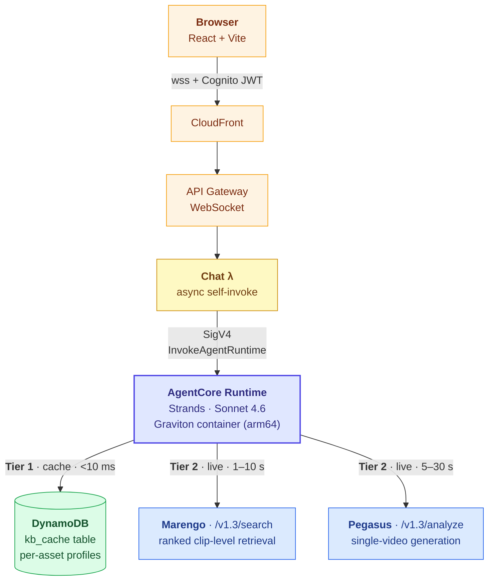
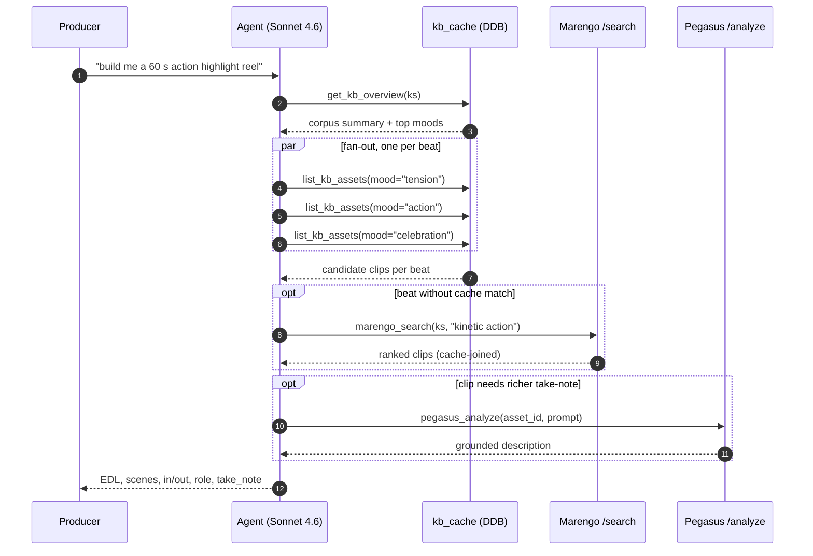
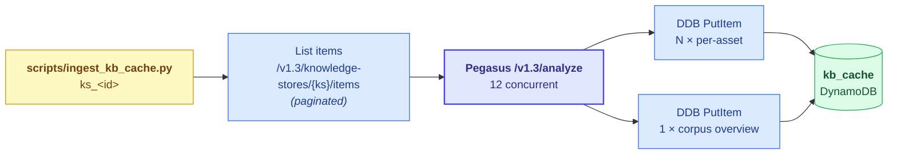

# Building Agentic Highlight-Reel Pipelines on AWS

**An AgentCore × TwelveLabs reference architecture**

---

## 1 · Executive summary

The producer's "find me the highlights" task collapses from hours to
seconds when the agent can read the indexed library directly. Bedrock
AgentCore plus TwelveLabs Marengo and Pegasus is the AWS-native path to
that workflow without writing custom retrieval, custom ranking, or custom
generative-vision code.

The architecture generalizes from highlights to sports recaps, ad
cutdowns, social shorts, and newsroom workflows with no agent-runtime
changes.

---

## 2 · The problem

### 2.1 What a producer actually does

Today, "build me a 60-second action highlight reel" is a multi-hour task:

1. Scrub the source footage (or trust someone else's notes).
2. Find candidate clips by memory, filename, or a brittle search.
3. Pick in/out points.
4. Stitch and review.
5. Iterate.

The shared property of every minute spent: the producer is the only
component in the system that has watched the video. Everything else
(filenames, transcripts, manual logs) is a proxy for what's actually on
screen.

### 2.2 What "good" looks like

The agent should be able to ask the library: *"clips that look like a
celebration after a tense moment"*, and get clip-level results with start
and end timecodes, ranked by semantic match, with a one-line *why*. That
is what Marengo and Pegasus return.

---

## 3 · Architecture overview

### 3.1 Component map



### 3.2 The two-tier tool design

The agent has access to two speed classes of tool. The system prompt
requires it to try the fastest tier first.

| Tier | Tool | p50 latency | When |
|---|---|---|---|
| 1 | `get_kb_overview` / `list_kb_assets` / `lookup_asset_profile` | <10 ms | Always start here on a known KS |
| 2 | `marengo_search` / `pegasus_analyze` / `list_tl_indexes` | 1–10 s | Cache miss, or needs in-clip timecodes |

The cache answers structural questions ("what's in this KB?", "find me
action clips") without ever calling a model at runtime. The live
primitives kick in only when a beat needs a fine-grained timecode or a
fresh description that wasn't captured at index time.

A typical six-beat rough-cut turn cascades through the tiers like this:



### 3.3 Why AgentCore (not Bedrock Agents)

| Concern | Bedrock Agents | AgentCore |
|---|---|---|
| Long-running multi-step tool calls | 60 s integration cap | Async invoke; multi-minute runs |
| Framework choice | Bedrock-flavored | Strands · CrewAI · any |
| Tool catalog | OpenAPI action groups | MCP via Gateway (or inline) |
| Identity | IAM only | Cognito JWT end-to-end through Gateway |
| Compute | Managed | Customer container (arm64 Graviton) |

For the highlight workflow specifically, a 6-beat rough cut routinely
needs 8–15 tool calls. The runtime needs to support a 2–3 minute envelope
without architectural gymnastics. AgentCore does; Bedrock Agents requires
async-self-invoke workarounds.

---

## 4 · The cache-first pattern

### 4.1 The naïve path is too slow

A 6-beat highlight reel built from `marengo_search` and `pegasus_analyze`
alone, across a 1,300-clip knowledge store, takes 3–5 minutes. That is
not interactive. Producers will not use it.

### 4.2 The shape of a per-asset profile

At index time, every asset in the knowledge store is run through a
single Pegasus call that produces a structured profile:

- One-line description
- Mood tags (tension, action, celebration, …)
- Visual style (handheld, wide, kinetic, …)
- Role hint (establishing, hero, b-roll, …)
- Subject and entity surface

The profile is stored as a row in a DynamoDB table (`kb_cache`), keyed
by knowledge-store id and asset id. A single additional row per
knowledge store rolls those profiles up into a corpus overview: total
asset count, dominant moods, dominant styles, sample titles. The agent
reads either at single-digit-millisecond latency.

### 4.3 Building the cache

We ship the same ingestion as a script:



Throughput: roughly 150 assets per minute. A 1,300-clip KB takes about
15 minutes to ingest.

Three agent tools read it back at runtime:

- `get_kb_overview(ks_id)`: corpus summary
- `list_kb_assets(ks_id, mood=…, role=…)`: filtered asset list
- `lookup_asset_profile(ks_id, asset_id)`: single-asset cached digest

### 4.4 Measured impact

| Same prompt, same KB (1,317 clips) | Latency |
|---|---|
| Live `marengo_search` + `pegasus_analyze` only | ~210 s |
| Cache-first (Tier 1 → Tier 2 fallback) | ~55 s |

Cache-first cuts the six-beat highlight job from over three minutes to
under one. That is the difference between a batch tool a producer uses
overnight and an interactive tool they use at their desk. The cache is
the lever; the Strands agent on AgentCore Runtime is the orchestrator.

---

## 5 · The agent tool catalog

Detailed contract for each tool. Source of truth: `agent/tl_agentcore/agent.py`.

### 5.1 `marengo_search(index_id, query_text, knowledge_store_id?)`

Ranked clip-level retrieval. Always pass `knowledge_store_id` when known.
Marengo joins the cache and returns clips already enriched with
title, one_liner, mood_tags, and role_hint, eliminating most follow-up
Pegasus calls.

The agent runs one Marengo call per beat in every rough-cut turn,
regardless of whether the cache already supplied a primary clip. The
top-ranked result becomes (or confirms) the primary; the next two to
four are emitted as `alternatives` on the EDL clip object, so a producer
can swap any pick for a similarly-ranked option in the UI without
re-running the agent.

### 5.2 `pegasus_analyze(target, prompt)`

Single-video generation. Used when a cached `one_liner` does not answer
the beat (for example, *"what specifically happens at 0:32–0:38 in this
clip?"*).

### 5.3 `list_tl_indexes()`

Discovery. Skipped when the index is already in context.

### 5.4 `get_kb_overview` / `list_kb_assets` / `lookup_asset_profile`

The Tier-1 cache tools; see §4.

---

## 6 · Deployment recipe

Terraform-only deployment. The stack under `infra/` provisions, end-to-end:

- **Runtime.** `aws_bedrockagentcore_agent_runtime` running the Strands
  agent container (arm64 Graviton, pulled from ECR by tag), with a
  versioned `aws_bedrockagentcore_agent_runtime_endpoint` for callers.
- **Cache.** `kb_cache` DynamoDB table, `pk = ks_<id>`, `sk = asset_<id>`
  or `sk = OVERVIEW`.
- **Edge + transport.** CloudFront fronts an S3 bucket of built UI
  assets plus two API Gateway origins: a WebSocket for the chat lambda
  that invokes the runtime, and an HTTP API for the `tl_proxy` lambda
  that forwards `/tl/*` browser calls to the TwelveLabs API.
- **Identity.** Cognito User Pool with `allow_admin_create_user_only =
  true`: no self-registration, and admins onboard every user via
  `aws cognito-idp admin-create-user`. An `admins` group surfaces the
  admin role to the UI as a claim. The Cognito JWT flows end-to-end
  from browser through CloudFront, through the WebSocket and HTTP APIs,
  and into the lambdas that verify it before invoking the runtime.
- **Secrets.** The TwelveLabs API key lives in Secrets Manager; both
  the runtime container and the `tl_proxy` lambda read it at startup.
- **Gateway.** `gateway.tf` is documented but not enabled in this
  reference implementation. A future evolution moves the agent tools
  out of the runtime container into MCP-served lambdas behind
  AgentCore Gateway, so the tool catalog is administered as
  infrastructure instead of code.

```bash
cd infra
terraform init
terraform apply -var="tl_api_key=tlk_..." -var="seed_admin_email=you@example.com"
```

Build and push the agent container:

```bash
./build-agent.sh   # docker buildx build --platform linux/arm64 …
```

Ingest the cache for an existing KB:

```bash
python scripts/ingest_kb_cache.py ks_<id>
```

### 6.1 Hard-won gotchas

- **AgentCore Runtime is arm64-only.** linux/amd64 images get rejected at
  `CreateAgentRuntime` with `Architecture incompatible`.
- **API Gateway WebSocket has a 30 s integration cap.** Cannot be raised.
  Forces an async self-invoke pattern in the chat lambda.
- **Async lambda retry produces phantom duplicate runs.**
  `aws_lambda_function_event_invoke_config { maximum_retry_attempts = 0 }`
  is mandatory; otherwise every timeout fires the agent twice.
- **`runtime-session-id` must be ≥33 chars.** Short ids get rejected. Pad.
- **AWS provider ≥6.30** is required for `aws_bedrockagentcore_*` resources.
- **AgentCore Runtime → custom HTTP timeouts.** AWS SDK default
  socketTimeout (180 s) is below the 300 s lambda cap. Set NodeHttpHandler
  `socketTimeout: 280_000` explicitly.

---

## 7 · Generalization

The architecture is vertical-agnostic by design. To switch use cases,
only two things change:

1. **The system prompt:** what the agent is being asked to assemble
   (highlight reel → news recap → ad cutdown → channel block).
2. **The ingestion profile schema:** what gets cached per asset.

Worked examples:

- **Sports recaps.** Profile schema gains `play_type`, `momentum_shift`,
  `crowd_energy`. Prompt asks for narrative arc, not mood arc.
- **Social cutdowns.** Profile schema gains `vertical_safe`, `hook_window`,
  `caption_friendly`. Prompt biases short, kinetic, opening-strong.
- **Newsroom dossiers.** Profile schema gains `entity_appearances`,
  `quote_density`. Prompt asks for chronology and sources.
- **FAST channel programming.** Multi-prompt: rough-cut per show, then
  schedule. Adds an audience-intelligence DDB tool.

The TwelveLabs models (Marengo and Pegasus) do not change. The agent
runtime (AgentCore) does not change. Only the prompt and the cache schema.

---

## 8 · Reference implementation

The companion repository contains:

- `agent/`: Strands agent and tools (Python, packaged into the arm64
  AgentCore Runtime container)
- `ui/`: React + Vite SPA with the Rough Cut and Agent tabs, the live
  architecture diagram, and a Playwright E2E suite in `ui/e2e/`
- `lambda/`: chat lambda (WebSocket → InvokeAgentRuntime) and
  `tl_proxy` lambda (the browser's `/tl/*` forwarder)
- `infra/`: Terraform for one-command deployment
- `scripts/`: `ingest_kb_cache.py` (cache builder) and
  `setup_test_fixtures.sh` (creates the E2E knowledge store)

A reader can `terraform apply` and have a working endpoint in roughly 15
minutes, plus the cache-ingestion time for whatever KB they bring.

---

## 9 · Where this goes next

| Follow-on | Status |
|---|---|
| Pegasus 1.5 on Bedrock Marketplace, addendum on launch | pending Bedrock ETA |
| Sports-recap variant (white paper #2) | scoped |
| Newsroom dossier variant (white paper #3) | scoped |
| FAST-channel programming variant (white paper #4) | scoped |
| Open-source MCP server for TwelveLabs primitives | proposed to AWS |
| Typed `attach_video_knowledge` primitive in AgentCore | proposed to AWS |

---

*Authors: TwelveLabs and AWS.*
